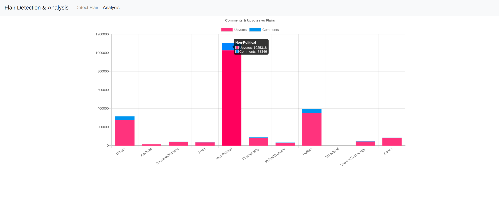

# Reddit Flair Detection

A django based web application which detects flairs of [India subreddit](https://www.reddit.com/r/india/) posts using MLP classifier.

### Directory Structure
  
   1. [Jupyter Notebooks](https://github.com/lshreyasharmal/Reddit-Flair-Detection/tree/master/Jupyter%20Notebooks) - Folder containing Jupyter Notebooks containing codes to collect, preprocess and train machine learning models.
  2. [MongoDB Data](https://github.com/lshreyasharmal/Reddit-Flair-Detection/tree/master/MongoDB%20Data/flair_database) - The database used to train models. contains testing and training data.
  3. [flair](https://github.com/lshreyasharmal/Reddit-Flair-Detection/tree/master/flair) - Contains the main application with two web pages - Detect Flair and Analysis. Detect Flair is a predictor that outputs a flair for a given post url. Analysis shows graph depicting no. of comments & upvotes against flairs.
  4. [mysite](https://github.com/lshreyasharmal/Reddit-Flair-Detection/tree/master/mysite) - Contains the django applicaton configurations.
  5. [Procfile](https://github.com/lshreyasharmal/Reddit-Flair-Detection/blob/master/Procfile) - Needed to setup Heroku.
  6. [manage.py](https://github.com/lshreyasharmal/Reddit-Flair-Detection/blob/master/manage.py) - Used to start the django server.
  7. [requirements.txt](https://github.com/lshreyasharmal/Reddit-Flair-Detection/blob/master/requirements.txt) - Contains all the dependencies for the webapp. (heroku)
  8. [runtime.txt](https://github.com/lshreyasharmal/Reddit-Flair-Detection/blob/master/runtime.txt) - contains the python version needed for this project. (heroku)
  
### CodeBase

Python 2.7 programming language is create the source code of this project.

### Project Execution

  1. Open the `Terminal`.
  2. Clone the repository by entering `git clone https://github.com/radonys/Reddit-Flair-Detector.git`.
  3. Ensure that `Python2` and `pip` is installed on the system.
  4. install dependencies present in requirements.txt
  5. Now, start the server by executing the following command: `python manage.py runserver` and it will point to the `localhost` with the port.
  6. Hit the "`IP Address`/flair" on a web browser and use the application. 
  
### Dependencies

Install the following dependencies which can also be foundh here with specific versions: [requirements.txt](https://github.com/radonys/Reddit-Flair-Detector/blob/master/requirements.txt):

  1. [praw](https://praw.readthedocs.io/en/latest/)
  2. [scikit-learn](https://scikit-learn.org/)
  3. [nltk](https://www.nltk.org/)
  4. [Django](https://www.djangoproject.com/)
  7. [pandas](https://pandas.pydata.org/)
  8. [numpy](http://www.numpy.org/)
  9. [gensim](https://pypi.org/project/gensim/)
  
### Approach

  1. [Data Collection](https://github.com/lshreyasharmal/Reddit-Flair-Detection/blob/master/Jupyter%20Notebooks/Data%20Collection.ipynb) Collected ~1000 India subreddit posts data using `praw` module. The data includes the following features: 
  num_comments, ups, is_reddit_media_domain, is_robot_indexable, is_video, no_follow, title, is_original_content, send_replies, permalink, edited, upvote_ratio, author, selftext, over_18, comments, subreddit_subscribers, secure_media, num_duplicates, url, distinguished, link_flair_text
  2. [Pre-process and Split](https://github.com/lshreyasharmal/Reddit-Flair-Detection/blob/master/Jupyter%20Notebooks/Pre-process%20and%20Split.ipynb) Then data is preprocessed such that string type features are tokenized and transformed into vectors using fast text. Boolean features are converted to int and float/int features are scaled using [MinMaxScalar](https://scikit-learn.org/stable/modules/generated/sklearn.preprocessing.MinMaxScaler.html). Then data is split into testing and training datasets **(80:20)** and stored in mongodb.
  3. [Create Model.](https://github.com/lshreyasharmal/Reddit-Flair-Detection/blob/master/Jupyter%20Notebooks/Create%20Model.ipynb) Using the dataset created. Various models were trained using different combinations of features. Used the following classifiers to train the dataset:
   
    a) Linear Support Vector Machine
    b) Random Forest
    c) MLP

   4. Training and Testing on the dataset showed that **MLP Classifier** showed the best testing accuracy of **61.11%** when trained on all features.
   15. The best model is saved and is used for prediction of the flair from the URL of the post.
    
### Results

#### All Features

| Machine Learning Algorithm | Test Accuracy |
| -------------              |:-------------:|
| Linear SVM                 | 0.58          |
| Random Forest              | 0.59          |
| MLP                        | 0.61          |

#### URL as Feature

| Machine Learning Algorithm | Test Accuracy |
| -------------              |:-------------:|
| Linear SVM                 | 0.51          |
| Random Forest              | 0.52          |
| MLP                        | 0.50          |

#### COMMENT as Feature

| Machine Learning Algorithm | Test Accuracy |
| -------------              |:-------------:|
| Linear SVM                 | 0.58          |
| Random Forest              | 0.59          |
| MLP                        | 0.61          |

#### TITLE as Feature

| Machine Learning Algorithm | Test Accuracy |
| -------------              |:-------------:|
| Linear SVM                 | 0.49          |
| Random Forest              | 0.50          |
| MLP                        | 0.50          |

#### TITLE + COMMENT + SELF TEXT as Feature

| Machine Learning Algorithm | Test Accuracy |
| -------------              |:-------------:|
| Linear SVM                 | 0.57          |
| Random Forest              | 0.58          |
| MLP                        | 0.59          |

#### Boolean + Numerical Features

| Machine Learning Algorithm | Test Accuracy |
| -------------              |:-------------:|
| Linear SVM                 | 0.49          |
| Random Forest              | 0.50          |
| MLP                        | 0.47          |

#### Accuracies for other combinations are present in the jupyter notebook [Create Model](https://github.com/lshreyasharmal/Reddit-Flair-Detection/blob/master/Jupyter%20Notebooks/Create%20Model.ipynb)

### Future Work and Improvements
  1. Since the project uses git and git lfs, there is some integration problem with Heroku because of which models are not being loaded. Hopefully, will figure it out and deploy the app online.
  2. Collect more posts such that posts belonging to all Flairs can be used. Currently, the data is uneven and there is no data belonging to Scheduled Flair.

### WebApp Screenshots

### References

1. [How to scrape data from Reddit](https://praw.readthedocs.io/en/latest/code_overview/models/subreddit.html)
2. [Readme Reference](https://github.com/radonys/Reddit-Flair-Detector/blob/master/README.md)
